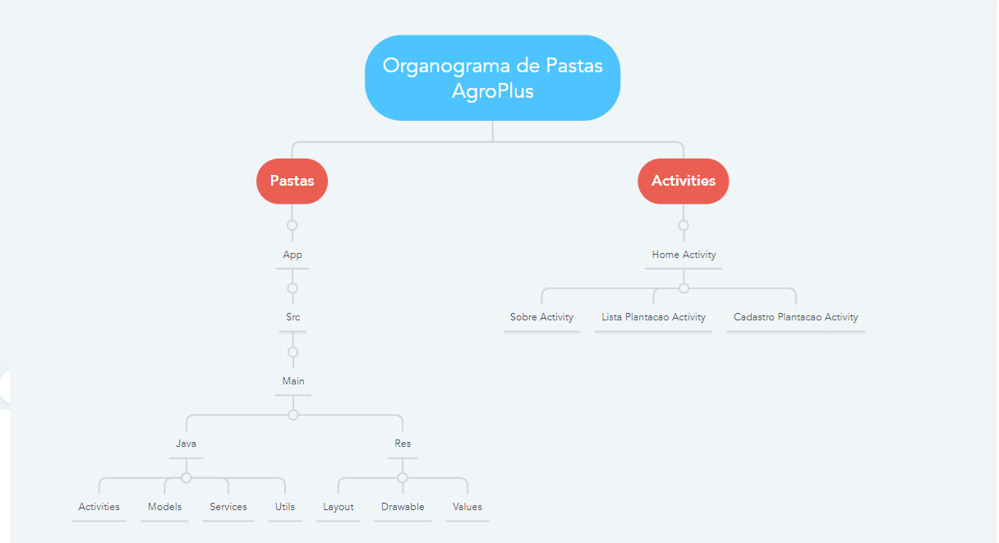

# AgroPlus

## Integrantes

- Caio Boris RM552496
- Denner Duarte RM551938
- Matheus Paulo Lima Delgado RM552189
- Nathaly Oliveira RM552538
- Lucas Petroni RM97861

## Descrição do Projeto

Este projeto visa auxiliar empresas do setor agrícola a coletar dados sobre regiões de plantação, permitindo a análise para oferecer produtos adequados aos clientes no momento certo. A solução aprimora a tomada de decisão, otimizando a oferta de produtos conforme as necessidades de cada região.

## Funcionalidades

- Cadastro e listagem de regiões de plantação.
- Análise dos dados coletados.
- Navegação simples entre as telas do aplicativo.

## Diagrama de arquitetura (Pastas) 
Baseado nas aulas que tivemos até então, sigamos a seguinte estrutura de pastas:

```console

Mobile/
│
├── app/
│   ├── src/
│   │   ├── main/
│   │   │   ├── java/
│   │   │   │   └── br/
│   │   │   │       └── com.fiap.mobile.sprint3/
│   │   │   │           ├── activities/
│   │   │   │           │   ├── CadastroPlantacaoActivity.kt
│   │   │   │           │   ├── HelloActivity.kt
│   │   │   │           │   ├── HomeActivity.kt
│   │   │   │           │   ├── ListaActivity.kt
│   │   │   │           │   └── SobreActivity.kt
│   │   │   │           ├── model/
│   │   │   │           │   └── Plantacao.kt
│   │   │   ├── res/
│   │   │   │   ├── layout/
│   │   │   │   │   ├── cadastro_plantacao.xml
│   │   │   │   │   ├── hello.xml
│   │   │   │   │   ├── home.xml
│   │   │   │   │   ├── listagem_plantacoes.xml
│   │   │   │   │   └── sobre.xml
│   │   └── AndroidManifest.xml
│   ├── build.gradle
│   └── ...
└── gradle/

```

